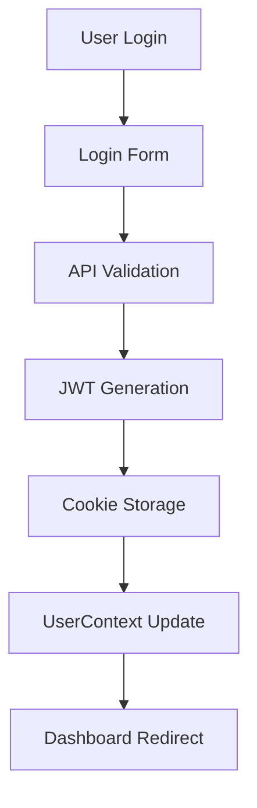
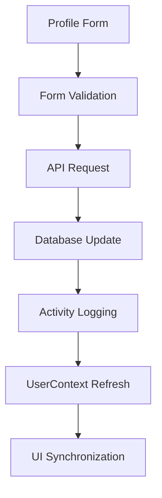

# 🏗️ Project Architecture

This document outlines the project architecture for DROMIC-IS, including the directory structure and key architectural patterns employed.

## Directory Structure

```
dromic-is/
├── 📁 public/                        # Static assets and resources
│   └── AGAPP.png                     # Application logo and branding
├── 📁 src/                           # Source code directory
│   ├── 📁 app/                       # Next.js App Router structure
│   │   ├── 📁 (auth)/               # Authentication route group
│   │   │   ├── 📁 login/            # Login functionality
│   │   │   │   ├── page.tsx         # Login page component
│   │   │   │   └── _components/     # Login-specific components
│   │   │   │       └── login-form.tsx
│   │   │   ├── 📁 register/         # User registration
│   │   │   │   ├── page.tsx         # Registration page
│   │   │   │   └── _components/     # Registration components
│   │   │   │       └── register-form.tsx
│   │   │   ├── 📁 forgot-password/  # Password recovery
│   │   │   │   ├── page.tsx         # Password reset page
│   │   │   │   └── _components/     # Password reset components
│   │   │   │       └── forgot-password-form.tsx
│   │   │   └── layout.tsx           # Auth layout wrapper
│   │   ├── 📁 (main)/               # Main application route group
│   │   │   ├── 📁 dashboard/        # Main dashboard interface
│   │   │   │   └── page.tsx         # Dashboard page with analytics
│   │   │   ├── 📁 reports/          # Reporting system
│   │   │   │   ├── incidents/       # Incident management
│   │   │   │   │   └── page.tsx
│   │   │   │   └── summary/         # Summary reports
│   │   │   │       └── page.tsx
│   │   │   ├── 📁 dromic-matrix/    # DROMIC matrix functionality
│   │   │   │   └── view/            # Matrix viewing interface
│   │   │   │       └── page.tsx
│   │   │   ├── 📁 navigation/       # Navigation components
│   │   │   │   ├── navbar.tsx       # Main navigation bar
│   │   │   │   ├── page.tsx         # Navigation test page
│   │   │   │   └── components/      # Navigation sub-components
│   │   │   │       └── ProfileDropdown.tsx
│   │   │   ├── 📁 profile/              # User Profile Management (ENHANCED)
│   │   │   │   ├── page.tsx             # Main profile page with UserContext integration
│   │   │   │   └── 📁 _components/      # Profile management components
│   │   │   │       ├── ProfileHeader.tsx      # User profile header
│   │   │   │       ├── EditProfileForm.tsx    # Profile editing with real-time sync
│   │   │   │       ├── ChangePasswordForm.tsx # Password change with security logging
│   │   │   │       ├── ActivityLog.tsx        # Paginated activity log viewer (5 per page)
│   │   │   │       └── AccountSettings.tsx    # Account settings management
│   │   │   └── layout.tsx           # Main layout with navbar
│   │   ├── 📁 api/                  # Backend API Routes (NEW)
│   │   │   ├── 📁 auth/             # Authentication endpoints
│   │   │   │   ├── login/           # POST /api/auth/login
│   │   │   │   │   └── route.ts     # Login endpoint
│   │   │   │   ├── register/        # POST /api/auth/register
│   │   │   │   │   └── route.ts     # Registration endpoint
│   │   │   │   ├── me/              # GET /api/auth/me
│   │   │   │   │   └── route.ts     # Current user endpoint
│   │   │   │   └── logout/          # POST /api/auth/logout
│   │   │   │       └── route.ts     # Logout endpoint
│   │   │   └── 📁 user/             # User Management endpoints (NEW)
│   │   │       ├── profile/         # PATCH /api/user/profile
│   │   │       │   └── route.ts     # Profile update endpoint
│   │   │       ├── change-password/ # POST /api/user/change-password
│   │   │       │   └── route.ts     # Password change endpoint
│   │   │       └── activity/        # GET /api/user/activity
│   │   │           └── route.ts     # Activity log endpoint
│   │   ├── layout.tsx               # Root application layout
│   │   ├── page.tsx                 # Homepage (redirects to dashboard)
│   │   ├── globals.css              # Global styles and CSS variables
│   │   ├── form-styles.css          # Form-specific styling utilities
│   │   └── favicon.ico              # Application favicon
│   ├── 📁 components/               # Reusable component library
│   │   ├── 📁 charts/              # Data visualization components
│   │   │   ├── incident-trends.tsx  # Incident trend analysis
│   │   │   ├── regional-activity.tsx # Regional data visualization
│   │   │   ├── resource-distribution.tsx # Resource allocation charts
│   │   │   └── response-time.tsx    # Response time analytics
│   │   ├── 📁 forms/               # Interactive form components
│   │   │   ├── activity-form.tsx    # Activity management forms
│   │   │   ├── analytics-form.tsx   # Analytics configuration
│   │   │   ├── quick-actions-form.tsx # Quick action interfaces
│   │   │   └── stats-form.tsx       # Statistics input forms
│   │   ├── 📁 layout/              # Layout and structural components
│   │   │   └── footer.tsx           # Application footer
│   │   └── 📁 ui/                  # Core UI component library
│   │       ├── card.tsx             # Card container component
│   │       ├── chart-card.tsx       # Chart wrapper component
│   │       ├── dashboard-grid.tsx   # Dashboard layout system
│   │       ├── module-container.tsx # Module wrapper component
│   │       ├── quick-action.tsx     # Quick action button component
│   │       ├── stats-card.tsx       # Statistics display card
│   │       └── 📁 form-fields/     # Form input components
│   │           ├── button.tsx       # Standardized button component
│   │           ├── checkbox.tsx     # Checkbox input component
│   │           ├── location-dropdown.tsx # Philippine location cascading dropdown (NEW)
│   │           └── text-input.tsx   # Text input with validation
│   └── 📁 lib/                     # Utility libraries and business logic
│       ├── 📁 contexts/            # React Context Providers (ENHANCED)
│       │   └── UserContext.tsx    # Global user state management with refreshUser()
│       ├── 📁 utils/               # Core utility functions
│       │   ├── auth.ts             # Authentication utilities (UPDATED)
│       │   ├── jwt.ts              # JWT token management (NEW)
│       │   ├── location.ts         # Philippine PSGC location utilities (NEW)
│       │   ├── password.ts         # Password hashing utilities (NEW)
│       │   └── validation.ts       # Zod validation schemas (NEW)
│       ├── 📁 data/               # Philippine Geographic Data (NEW)
│       │   ├── psgc_regions_1q23.json    # Philippine regions (17 regions)
│       │   ├── psgc_provinces_1q23.json  # Philippine provinces (81 provinces)
│       │   ├── psgc_cities_1q23.json     # Cities/municipalities (1,634 entries)
│       │   └── psgc_barangays_1q23.json  # Barangays (42,046 entries)
│       ├── db.ts                   # Database connection utility (NEW)
│       ├── utils.ts                # General utility functions
│       ├── 📁 hooks/              # Custom React hooks
│       │   ├── useLocationDropdown.ts # Location dropdown state management (NEW)
│       │   ├── Login/             # Login-related hooks
│       │   │   └── useLoginForm.ts # Updated with email/username support
│       │   └── Register/          # Registration hooks
│       │       └── useRegisterForm.ts # Updated with location validation
│       └── 📁 api/                # API integration utilities (placeholder)
├── 📁 Configuration Files
├── .env.local                      # Environment variables (NEW)
├── package.json                    # Project dependencies and scripts
├── package-lock.json              # Dependency lock file
├── tsconfig.json                  # TypeScript configuration
├── tailwind.config.js             # Tailwind CSS customization
├── next.config.ts                 # Next.js configuration
├── eslint.config.mjs              # ESLint configuration
├── postcss.config.js              # PostCSS configuration
├── postcss.config.mjs             # PostCSS ES module configuration
├── .gitignore                     # Git ignore patterns
└── .vscode/                       # VS Code workspace settings
    └── tasks.json                 # Development tasks configuration
```

## Architecture Patterns

### Route Organization
- **Route Groups**: `(auth)` and `(main)` for logical separation of concerns
- **Co-located Components**: Components stored in `_components` directories near their usage
- **Layout Inheritance**: Nested layouts for different application sections

### Component Design
- **Separation of Concerns**: UI components, business logic hooks, and utilities are clearly separated
- **Reusability**: Modular component design with consistent APIs
- **Type Safety**: Full TypeScript coverage with proper interface definitions

### State Management
- **Local State**: React hooks for component-level state management
- **Custom Hooks**: Business logic abstracted into reusable hooks
- **Client Storage**: localStorage for authentication and user preferences
- **Global Context**: UserContext for cross-component state synchronization

## Design Patterns

### Component Patterns

#### Container-Presenter Pattern
```typescript
// Container component handles logic
const ProfileContainer: React.FC = () => {
  const { user, updateUser } = useUser();
  const { formData, handlers } = useProfileForm(user);
  
  return <ProfilePresenter user={user} formData={formData} handlers={handlers} />;
};

// Presenter component handles UI
const ProfilePresenter: React.FC<ProfilePresenterProps> = ({ user, formData, handlers }) => {
  return (
    <div>
      {/* UI rendering */}
    </div>
  );
};
```

#### Custom Hook Pattern
```typescript
// Business logic abstracted into hooks
export const useLocationDropdown = () => {
  const [regions, setRegions] = useState<LocationData[]>([]);
  const [provinces, setProvinces] = useState<LocationData[]>([]);
  
  const loadProvinces = useCallback(async (regionCode: string) => {
    const data = await getProvincesByRegion(regionCode);
    setProvinces(data);
  }, []);
  
  return { regions, provinces, loadProvinces };
};
```

### Data Flow Architecture

#### Authentication Flow


#### Profile Update Flow


## Security Architecture

### Authentication Security
- **Password Hashing**: bcrypt with configurable salt rounds
- **Session Management**: JWT tokens with HTTP-only cookies
- **CSRF Protection**: SameSite cookie attributes
- **XSS Prevention**: Content Security Policy headers

### API Security
- **Input Validation**: Zod schemas for all endpoints
- **Rate Limiting**: Protection against brute force attacks
- **SQL Injection Prevention**: Parameterized queries
- **Authorization**: Role-based access control

### Data Protection
- **Encryption**: Sensitive data encryption at rest
- **Audit Logging**: Comprehensive activity tracking
- **Privacy**: GDPR-compliant data handling
- **Backup**: Regular database backups

## Performance Architecture

### Client-Side Optimization
- **Code Splitting**: Route-based automatic splitting
- **Lazy Loading**: Dynamic imports for non-critical components
- **Image Optimization**: Next.js Image component with WebP
- **Bundle Analysis**: Webpack bundle analyzer integration

### Server-Side Optimization
- **Static Generation**: Pre-rendered pages where possible
- **API Caching**: Intelligent caching strategies
- **Database Indexing**: Optimized query performance
- **CDN Integration**: Static asset delivery optimization

### Monitoring & Analytics
- **Performance Metrics**: Core Web Vitals tracking
- **Error Tracking**: Comprehensive error logging
- **User Analytics**: Usage pattern analysis
- **Database Monitoring**: Query performance tracking

## Scalability Considerations

### Horizontal Scaling
- **Stateless Design**: Session management via external storage
- **Database Sharding**: User data partitioning strategies
- **Load Balancing**: Multiple server instance support
- **Microservices**: Modular API architecture

### Vertical Scaling
- **Resource Optimization**: Memory and CPU usage monitoring
- **Database Optimization**: Query performance tuning
- **Caching Layers**: Redis/Memcached integration
- **Asset Optimization**: Image and script compression

## Development Architecture

### Code Organization
- **Feature-based Structure**: Components organized by functionality
- **Shared Libraries**: Reusable utilities and components
- **Type Definitions**: Centralized TypeScript interfaces
- **Configuration Management**: Environment-specific settings

### Testing Strategy
- **Unit Testing**: Component and utility function tests
- **Integration Testing**: API endpoint testing
- **E2E Testing**: User workflow validation
- **Performance Testing**: Load and stress testing

### DevOps Integration
- **CI/CD Pipeline**: Automated testing and deployment
- **Environment Management**: Development, staging, production
- **Monitoring**: Application and infrastructure monitoring
- **Documentation**: Automated API documentation generation

---

[← Back to Getting Started](GETTING_STARTED.md) | [Next: Authentication System →](AUTHENTICATION_SYSTEM.md)
